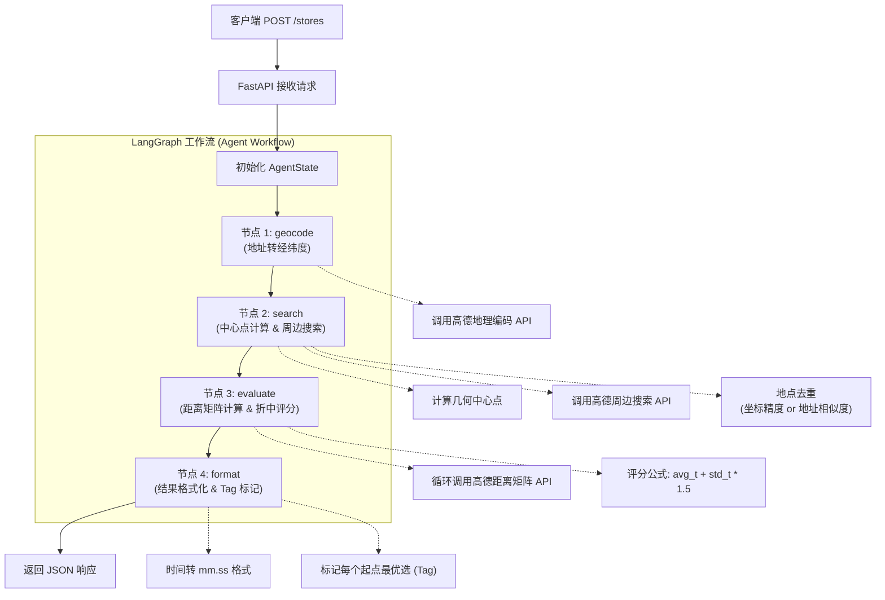

# 后端技术文档 (Backend Documentation)

本项目是一个基于 **LangGraph** 和 **FastAPI** 构建的智能地点推荐引擎，通过高德地图 API 实现多起点驾驶时间“折中”评估，为用户寻找最均衡的聚会或办事地点。

## 1. 技术栈 (Technology Stack)

| 组件 | 技术选型 | 主要用途 |
| :--- | :--- | :--- |
| **编程语言** | Python 3.14+ | 核心开发语言 |
| **Web 框架** | FastAPI | 提供 RESTful API 接口 |
| **工作流引擎** | LangGraph | 管理 Agent 状态机与节点执行逻辑 |
| **数据建模** | Pydantic | 请求/响应参数校验与结构化定义 |
| **HTTP 客户端** | HTTPX | 非阻塞异步调用高德地图 REST API |
| **服务器** | Uvicorn | ASGI 高性能 Web 服务器 |
| **环境变量** | Python-dotenv | 加载 API Key 等敏感配置 |

## 2. 执行流程 (Execution Flow)

以下是 `/stores` 接口被调用时的完整执行流程：

### 节点逻辑详解

1. **geocode (地理编码)**：将用户输入的多个原始地址异步转换为 GCJ02 坐标。
2. **search (搜索与去重)**：
    * 计算所有起点的几何中心。
    * 在中心点周边搜索目标类型的候选地点。
    * **去重逻辑**：满足“经纬度前4位一致”或“地址名称包含关系”任一条件即视为重复。
3. **evaluate (评估评分)**：
    * 通过高德距离矩阵获取各起点到达各候选点的实时驾驶时间。
    * **折中算法**：计算平均耗时与标准差，通过 `平均值 + 1.5 * 标准差` 综合评分。得分越低代表该地点对所有人越“公平”且耗时相对较短。
4. **format (格式化输出)**：
    * 将秒级耗时转换为 `mm.ss` 易读格式。
    * 动态计算 `tag`：在当前所有推荐方案中，标记出对该特定起点而言最优（耗时最短）的地点。

## 3. 环境要求

* **API Key**: 需在 `.env` 中配置 `AMAP_API_KEY`。
* **依赖安装**: `pip install -r requirements.txt`
* **启动命令**: `python main.py`
